# Heavy-Hitter Detection using Inter Packt Gap (IPG)
In this project, we take a completely different direction to detect Heavy-Hitter flows: keep track of per-flow Inter Packet Gap (IPG) metrics instead of packet counts. HH flows can be characterized by small IPG metrics calculated as a function (e.g. weighted average) of the inter-packet time intervals. 
The ``heaviness'' (i.e. throughput over time) of a packet flow can be approximated by relating the average packet size to the observed IPG values. 
This approach does not require a measurement interval to be set upfront, thus eliminating common shortfalls of windows-based algorithms. 

## Implementation in TNA P4_16
Our proposed IPG based HH detection can be fit with most of the exsiting packet count based data structcures to detect HH. For HH implementation on a Tofino hardware (HW) switch using IPG instead of packet count, we leverage the HeavyKeeper(HK) algorithm, you can find HK paper <a href="https://www.usenix.org/conference/atc18/presentation/gong">here</a>, which is amenable to programmable HW. The complete TNA P4_16 code can be find in "P4-TNA-HeavyHitter" folder. The code is succesfullfy compiled on Tofino Wedge100BF-32X switch. This version has been succesfully tested to detect heavy-hitter flows with CAIDA traces 2016 (10 Gbps link) using TRex Realistic Traffic Generator.  

## Implementation of SpaceSaving Algorithm using IPG instead of packet count
We also implement our proposed idea using SpaceSaving Algorithm. SpaceSaving is a well known algorithm to detect top-k flows, you can find the paper <a href="https://dl.acm.org/doi/10.1007/978-3-540-30570-5_27">here</a>. However, in this algorithm, packet count is the basic idea to find HH. We use this algorithm with IPG instead of packet count. As we know, due to the whole table scanning at the time to decide to keep flow or eliminate from data structure, we cannot implement this algorithm on programmable data plane. Therefore, we implement this on python based simulator to validate our idea. The complete code can be find "SpaceSaving-IPG" folder.        

### Exponential Weighted Moving Average (EWMA) of IPG vs flow throughputs for different size of Time-Windows using CAIDA traffic Trace-2016
For 1 Sec Time-Window:

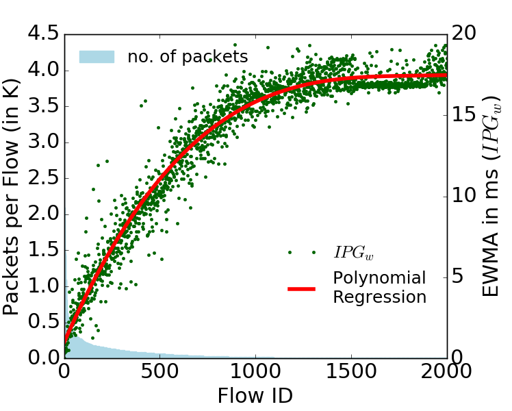 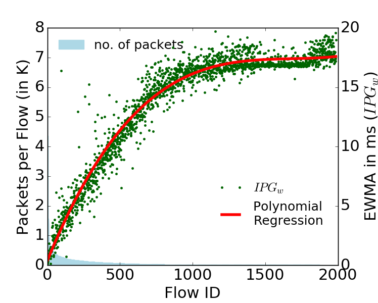 

For 5 Secs Time-Window

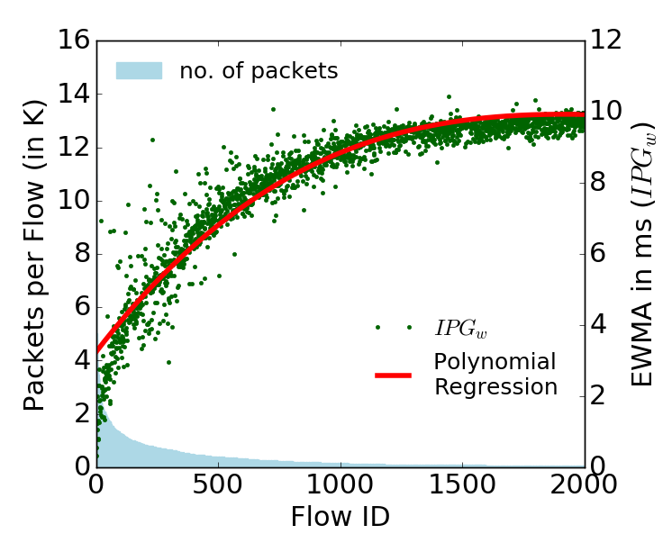 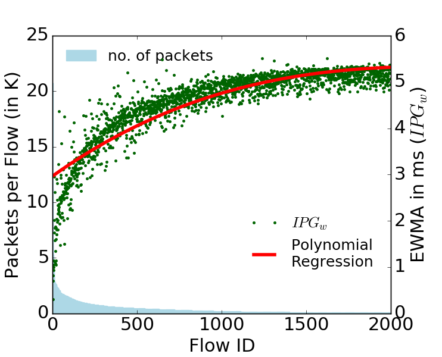

For 10 Secs Time-Window

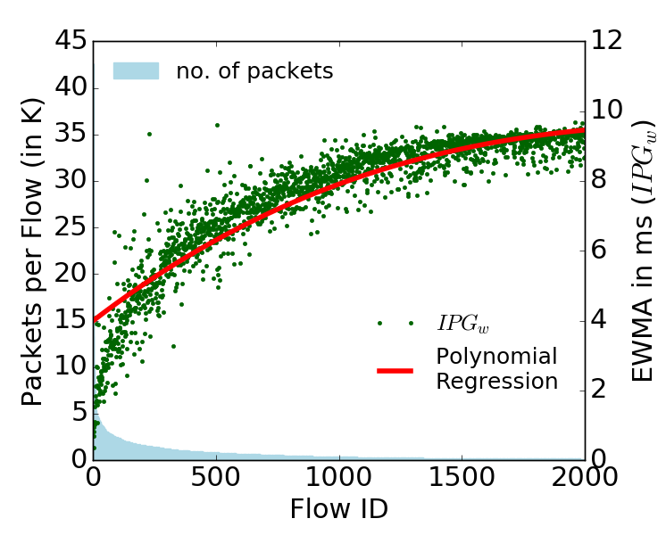 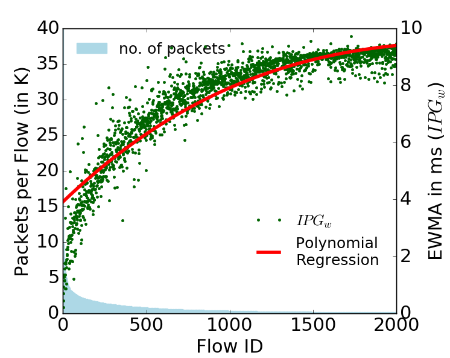

### EWMA of IPG with two different values of degree of weighting decrease vs Simple Moving Average for different number of flows using CAIDA traffic Trace-2016

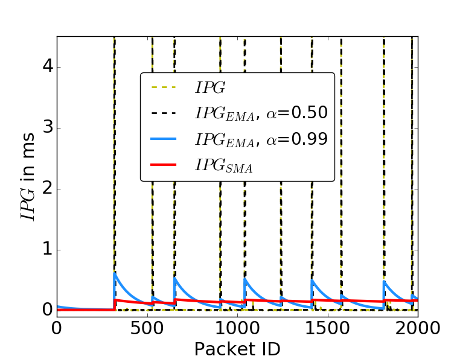 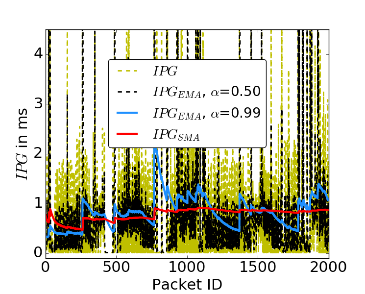 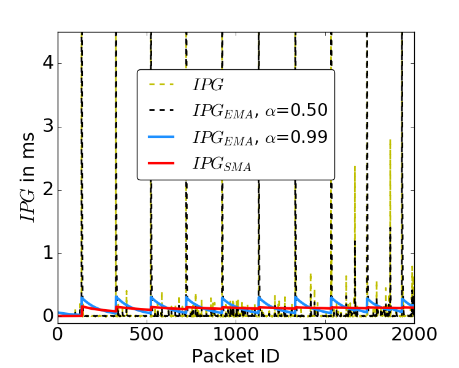 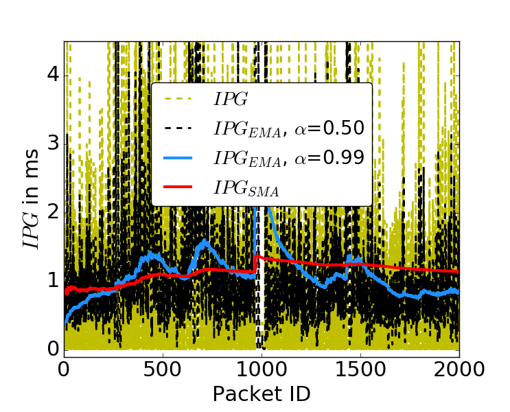 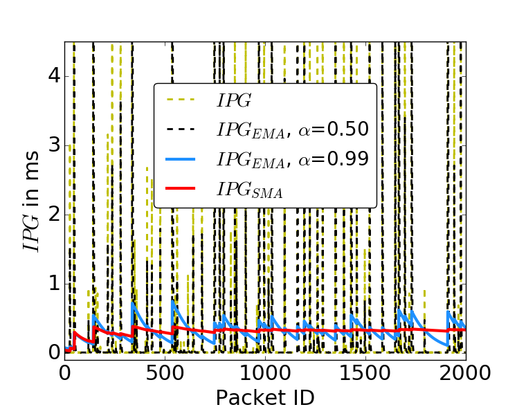 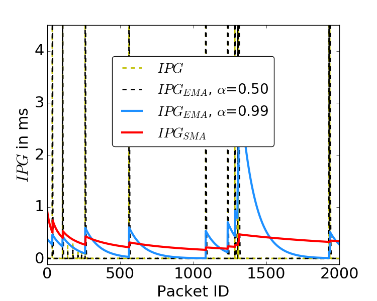

